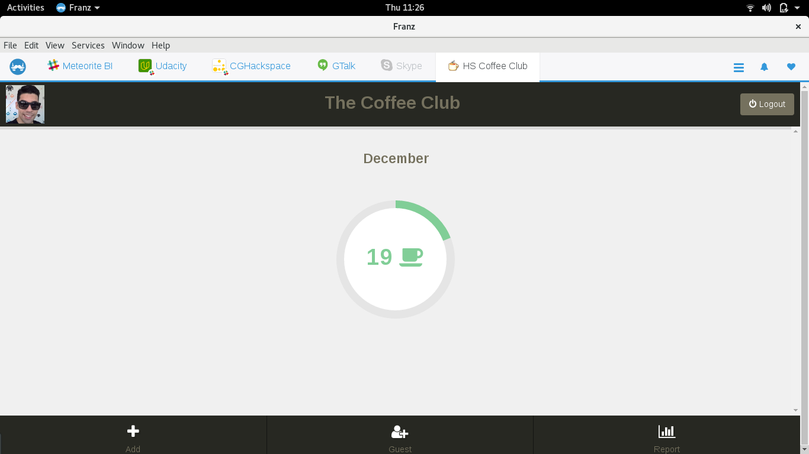

# The Coffee Club plugin for Franz

> [Franz](http://meetfranz.com/) - a free messaging app for Slack, Facebook Messenger, Whatsapp, Telegram and more.

## Installation

1. Make sure you've Franz version 4.0.0 or higher
2. Clone or [download](https://github.com/coffee-club/coffee-club-franz-plugin/archive/master.zip) plugin
3. Open the Franz Plugins folder on your machine:
  - Mac: `~Library/Application Support/Franz/Plugins/`
  - Windows: `%appdata%/Franz/Plugins`
  - Linux: `~/.config/Franz/Plugins`
  - *Alternatively: Go to your Franz settings page, scroll down to the bottom and you will see an option to "Open the Franz plugin directory"*
4. Copy the coffee-club folder into the plugins directory
5. Restart Franz

## Requirements

The minimum requirement to run a custom Franz integration is **Franz v. 4.0.0**. To get the latest version visit [meetfranz.com](http://meetfranz.com/).

## Contributing

If you want to help, please read the [Contributing](https://github.com/coffee-club/coffee-club-franz-plugin/blob/master/CONTRIBUTING.md) guide.

## History

For detailed changelog, see [Releases](https://github.com/coffee-club/coffee-club-franz-plugin/releases).

## Credits

- [Franz](http://meetfranz.com)
- [Iconfinder](https://www.iconfinder.com/icons/1393/coffee_cup_hot_tea_icon)

## License

[MIT License](http://brenopolanski.mit-license.org/) © Breno Polanski
